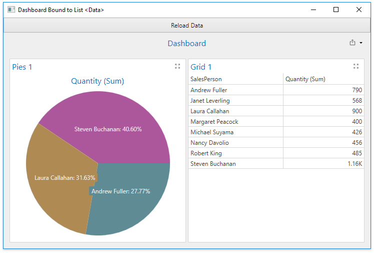

<!-- default badges list -->

[](https://supportcenter.devexpress.com/ticket/details/T830581)
[](https://docs.devexpress.com/GeneralInformation/403183)
<!-- default badges end -->
# BI Dashboard for WPF - How to Bind a Dashboard to a List&lt;Data&gt; Object

The example shows how to bind a dashboard to a System.Collections.Generic.List&lt;Data&gt; object.

This example creates a dashboard at runtime and assigns it to the [DashboardControl.DashboardSource](https://docs.devexpress.com/Dashboard/DevExpress.DashboardWpf.DashboardControl.DashboardSource) property in the `Window_Loaded` event handler. The dashboard adds the [DashboardObjectDataSource](https://docs.devexpress.com/Dashboard/DevExpress.DashboardCommon.DashboardObjectDataSource) object to its [DataSources](https://docs.devexpress.com/Dashboard/DevExpress.DashboardCommon.Dashboard.DataSources) collection and uses it as the data source for dashboard items.

The `DashboardObjectDataSource` gets its data in the [DashboardControl.AsyncDataLoading](https://docs.devexpress.com/Dashboard/DevExpress.DashboardWpf.DashboardControl.AsyncDataLoading) event. The collection of objects is assigned to the [e.Data](https://docs.devexpress.com/Dashboard/DevExpress.DashboardCommon.DataLoadingEventArgs.Data) property.

A data source in the [Dashboard.DataSources](https://docs.devexpress.com/Dashboard/DevExpress.DashboardCommon.Dashboard.DataSources) collection is determined by its name. The name is assigned in the [DashboardObjectDataSource](https://docs.devexpress.com/Dashboard/DevExpress.DashboardCommon.DashboardObjectDataSource) constructor.

**C#**

```cs
private void dashboardControl_AsyncDataLoading(object sender, DataLoadingEventArgs e)
{
    if (e.DataSourceName == "MyDataSource")
        e.Data = Data.CreateData();
}
```

**Visual Basic**

```vb
Private Sub dashboardControl_AsyncDataLoading(ByVal sender As Object, ByVal e As DataLoadingEventArgs)
    If e.DataSourceName = "MyDataSource" Then
        e.Data = Data.CreateData()
    End If
End Sub
```

The [DashboardControl.ReloadData](https://docs.devexpress.com/Dashboard/DevExpress.DashboardWpf.DashboardControl.ReloadData) method refreshes the data.

A dialog with a warning message is displayed before loading an object data source. This dialog is the security measure that allows end-users to prevent code execution in the object data sources. For more information, refer to the following document: [Security Considerations](https://docs.devexpress.com/Dashboard/400069/wpf-viewer/security-considerations).

If you trust the application's data sources, set the [DashboardControl.ObjectDataSourceLoadingBehavior](https://docs.devexpress.com/Dashboard/DevExpress.DashboardWpf.DashboardControl.ObjectDataSourceLoadingBehavior) property to `LoadAsIs` to suppress the warning.




## Documentation

- [WPF Dashboard Viewer - Provide Data](https://docs.devexpress.com/Dashboard/119901/wpf-viewer/providing-data)
- [Visual Studio Designer - Provide Data](https://docs.devexpress.com/Dashboard/18295/wpf-viewer/create-dashboards-in-the-visual-studio-designer/provide-data)
    
## More Examples

[Dashboard for WPF - How to bind a dashboard to an OLAP cube](https://github.com/DevExpress-Examples/wpf-dashboard-olap-data-provider)
